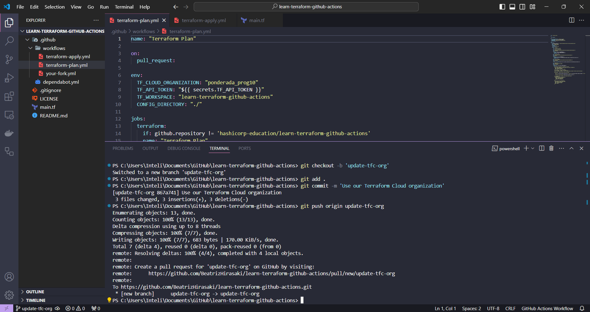
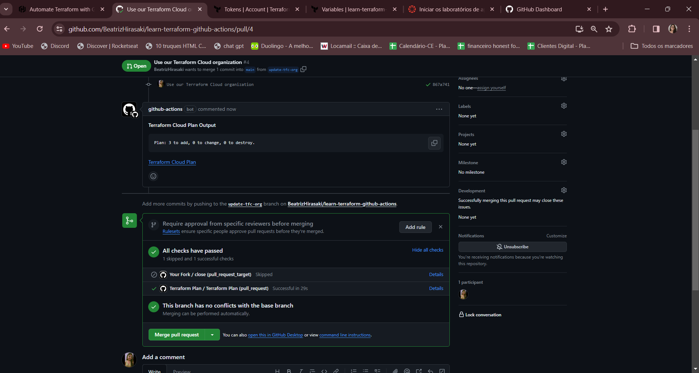
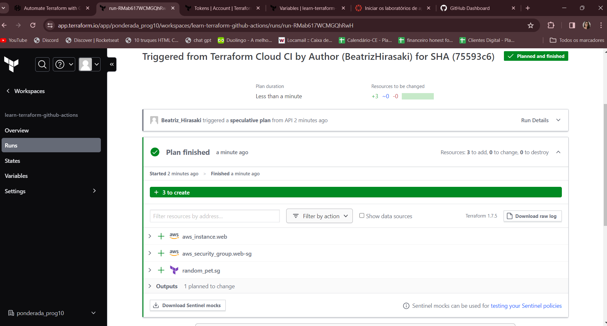
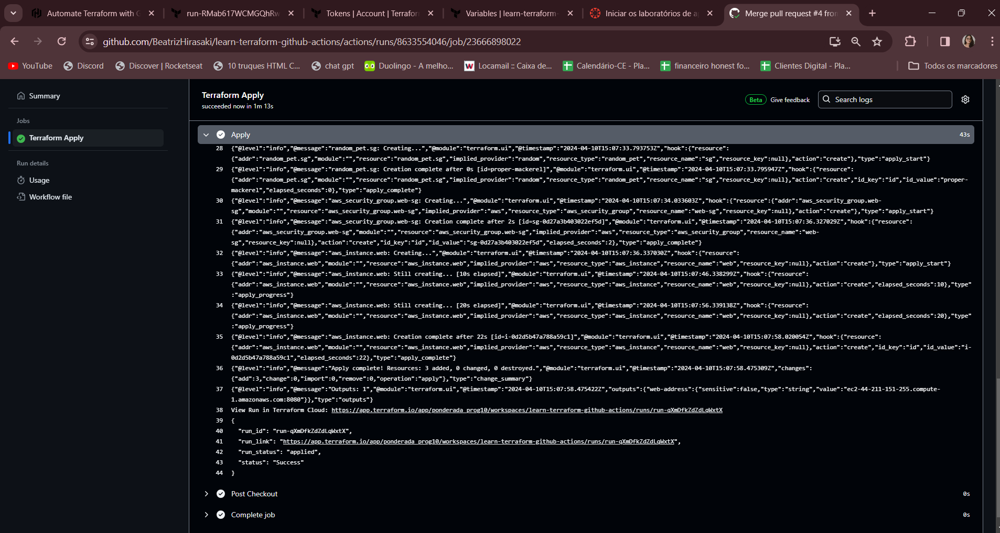
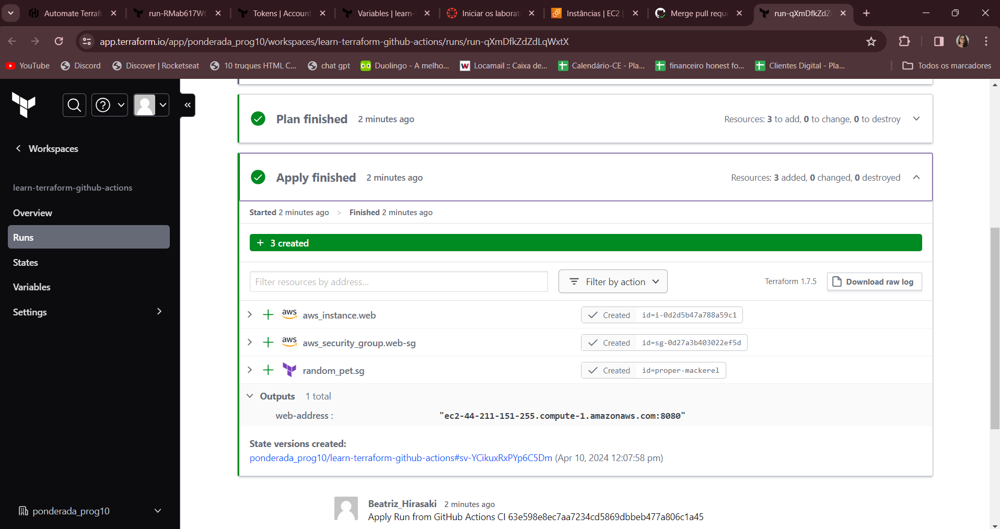
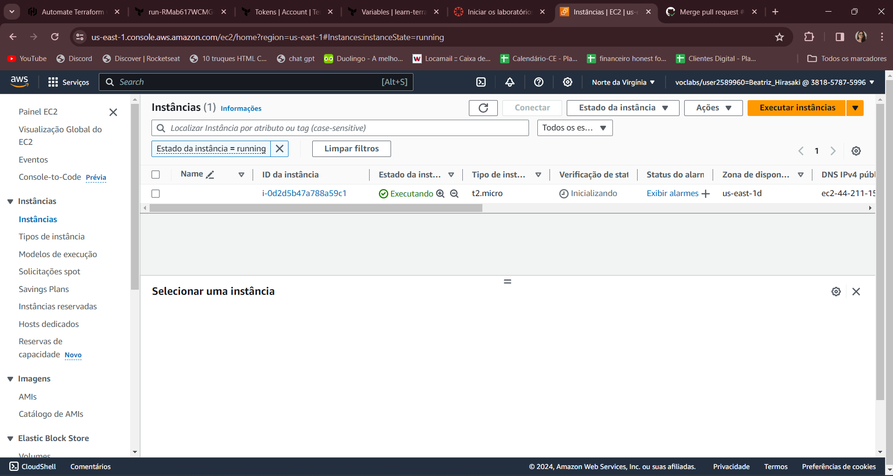

# Automação do Terraform com GitHub Actions

## Tecnologias e Conceitos Aprendidos

Durante o tutorial, aprendi a automatizar a implantação e gerenciamento de infraestrutura usando **Terraform** e **GitHub Actions**, duas poderosas ferramentas de automação. O **Terraform** é uma ferramenta de infraestrutura como código da HashiCorp que permite provisionar e gerenciar infraestrutura de forma declarativa. Integrá-lo com **GitHub Actions**, que oferece automação de fluxos de trabalho dentro de repositórios GitHub, facilita a implementação de práticas de CI/CD (Integração e Entrega Contínuas). Essa combinação nos permite configurar, testar e implantar infraestrutura automaticamente com cada mudança no código, melhorando a eficiência e reduzindo a possibilidade de erros humanos. Utilizamos o Terraform Cloud para uma gestão mais centralizada e controlada, e configuramos GitHub Actions para executar planos e aplicações automáticas de mudanças na infraestrutura baseando-se nas interações do repositório, como pull requests e merges na branch principal.

### GitHub Actions

GitHub Actions é uma funcionalidade do GitHub que possibilita a automação de workflows de software diretamente nos repositórios do GitHub. Isso inclui a automatização de compilações, testes e implantações, facilitando a aplicação de práticas de CI/CD.

### Terraform Cloud

Terraform Cloud é um serviço que ajuda na gestão do Terraform em equipes, fornecendo um ambiente de execução controlado e compartilhado para o Terraform. Suporta integração direta com GitHub via webhooks, o que permite que o Terraform Cloud execute operações de infraestrutura baseadas em eventos de repositórios GitHub.

### Fluxo de Trabalho de CI/CD com Terraform e GitHub Actions

Fluxo de trabalho:
- **Planos de Terraform** são gerados e revisados para cada commit em pull requests.
- A **aplicação de configurações** ocorre quando a branch principal é atualizada.

Essa automação é realizada através de duas GitHub Actions principais:
1. `terraform-plan.yml` para a criação de planos de mudança.
2. `terraform-apply.yml` para a aplicação das mudanças na infraestrutura.

## Configuração Inicial

### Requisitos

- Contas no GitHub, Terraform Cloud e AWS.
- Configuração de um workspace no Terraform Cloud e definição de variáveis de ambiente para autenticação na AWS.
- Geração de um token de API do Terraform Cloud para uso nas GitHub Actions.

### Setup no GitHub

- Criação de um repositório a partir de um modelo pré-definido.
- Configuração de segredos no GitHub para armazenar o token do Terraform Cloud.

## Fluxo de Trabalho Detalhado

1. **Criação de Pull Request (PR):** Ao fazer um PR, a GitHub Action para o plano é acionada, criando um plano especulativo que é revisado no Terraform Cloud.
2. **Mesclagem de PR e Aplicação de Mudanças:** Ao mesclar o PR, a Action de aplicação é acionada para atualizar a infraestrutura conforme definido pelo plano.
3. **Verificação e Destruição:** Após a aplicação, a instância EC2 pode ser verificada e eventualmente os recursos devem ser destruídos para evitar custos.

## Prints da execução do tutorial

## Conclusão

No tutorial, aprendi como combinar o Terraform com GitHub Actions para automatizar completamente a gestão de infraestrutura como código. Isso não apenas otimiza processos, mas também incorpora melhores práticas de colaboração e revisão dentro das equipes de desenvolvimento.
